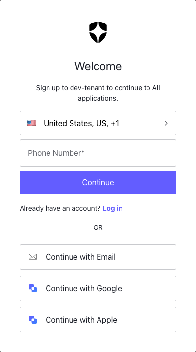
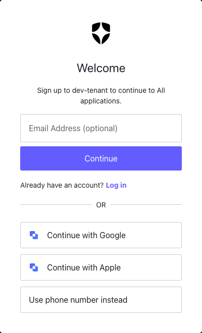

# Build a Phone-First Sign-Up Screen with Auth0 ACUL

Quick Highlevel Steps:
After Auth0 CLI is installed
<pre><code>auth0 acul init "Your_App_Name"
  --template "React (with ACUL <b>React SDK</b>)"
  --screens signup-id
</code></pre>

```bash
auth0 acul dev
```
Make code changes.

When ready connect to Auth0 Tenant using 
```bash
auth0 acul dev --connected
```
```bash
auth0 test login
```

Auth0's Advanced Customizations for Universal Login (ACUL) lets you replace any built-in authentication screen with your own React components — without giving up Auth0's security infrastructure. This tutorial walks through the full workflow, from CLI setup to a finished custom sign-up screen that:

- **Defaults to phone number** (country code picker + number field)
- **Hides email behind a "Continue with Email" button** in the OR section — so users see one clean input, not a field picker
- **Renders social login buttons** (Google, Apple, etc.) dynamically from the transaction context

> **Who is this for?** Developers who want to customize the Auth0 `signup-id` screen using the ACUL React SDK. You should be comfortable with React and have access to an Auth0 dashboard.
>
> **Finished code:** [github.com/varnerstanley/auth0-phone-first-signup](https://github.com/varnerstanley/auth0-phone-first-signup) — the complete project with all screens, mock context, CI/CD pipeline, and screenshots.

---

## Prerequisites

Before you begin, make sure you have:

| Requirement | Notes |
|---|---|
| Auth0 development tenant | A free dev tenant works fine |
| Custom domain configured | Required for ACUL — set up under **Branding → Custom Domains** |
| Universal Login enabled | Must be in **New Universal Login** mode (not Classic) |
| Node.js v22+ | `node --version` to check |
| Auth0 CLI v1.26+ | Install steps below |

---

## Step 1 — Install the Auth0 CLI

The Auth0 CLI (`auth0`) is how you scaffold, preview, and deploy ACUL screens.

**macOS (Homebrew):**
```bash
brew tap auth0/auth0-cli && brew install auth0
```

**Linux / Windows (via script):**
```bash
curl -sSfL https://raw.githubusercontent.com/auth0/auth0-cli/main/install.sh | sh -s -- -b .
```

**Verify:**
```bash
auth0 --version
# auth0 version 1.26.0 ...
```

**Log in:**
```bash
auth0 login
```

A browser tab opens for device authorization. After you approve it, the CLI confirms your active tenant:

```
✓ Tenant: your-tenant.us.auth0.com
```

---

## Step 2 — Configure Your Auth0 Tenant

### 2a. Enable New Universal Login

1. Go to **Branding → Universal Login** in the [Auth0 Dashboard](https://manage.auth0.com)
2. Make sure **New Universal Login** is selected (not Classic)

### 2b. Enable Identifier First Authentication

The `signup-id` screen requires **Identifier First** mode so Auth0 collects the identifier (phone or email) on its own step.

1. Go to **Authentication → Authentication Profile**
2. Select **Identifier First**
3. Save

### 2c. Enable Phone as an Identifier

1. Go to **Authentication → Database**
2. Open your database connection (usually `Username-Password-Authentication`)
3. Go to **Settings → Attributes**
4. Enable **Phone** as an identifier — set `signup_status` to `required` or `optional`
5. Save

---

## Step 3 — Initialize the ACUL Project

Scaffold the project with a single command. The `--template` and `--screens` flags skip all interactive prompts:

```bash
auth0 acul init auth0-phone-first-signup \
  --template "React (with ACUL React SDK)" \
  --screens signup-id
```

> **Why `"React (with ACUL React SDK)"`?** There are two template options — a plain JS SDK and a React SDK. The React SDK gives you typed hooks (`useTransaction`, `useScreen`, `useErrors`, etc.) for every screen and has the broadest screen coverage. The full quoted string is the exact template name the CLI expects.

When prompted to install npm dependencies, press **Y**:

```
? Would you like to proceed with installing the required dependencies using 'npm install'? Y
```

The CLI confirms success:

```
🎉 Project successfully created in 'auth0-phone-first-signup'!
📖 Explore the sample app: https://github.com/auth0-samples/auth0-acul-samples

Next Steps:
  Navigate to auth0-phone-first-signup
  Run npm install if dependencies are not installed
  Start the local dev server using
  auth0 acul dev
```
---

## Step 4 — Understand the Project Structure

The CLI generates a complete Vite + React project. The parts you'll touch are highlighted:

```
auth0-phone-first-signup/
├── public/
│   ├── manifest.json                        # Screen registry for the inspector
│   └── screens/
│       └── signup/
│           └── signup-id/
│               └── default.json             # ← Mock context data (you'll edit this)
├── src/
│   ├── components/                          # Pre-built UL theme components
│   │   ├── ULThemeCountryCodePicker.tsx     # Country code button
│   │   ├── ULThemeSocialProviderButton.tsx  # Social login button
│   │   └── ...
│   └── screens/
│       └── signup-id/
│           ├── index.tsx                    # ← Screen root (you'll edit this)
│           ├── components/
│           │   ├── AlternativeLogins.tsx    # ← Social buttons (you'll edit this)
│           │   ├── SignupIdForm.tsx         # ← Identifier form (you'll edit this)
│           │   ├── Header.tsx
│           │   └── Footer.tsx
│           ├── hooks/
│           │   └── useSignupIdManager.ts    # SDK hook wrapper
│           └── locales/
│               └── en.json                 # UI strings
├── package.json
└── vite.config.ts
```

The scaffold already includes `ULThemeCountryCodePicker` and `ULThemeSocialProviderButton` — pre-built components that match Auth0's Universal Login theme. You don't need to build those from scratch.

---

## Step 5 — Create the Mock Context

The local dev server uses a JSON file to simulate what Auth0 sends at runtime. The scaffold creates `public/screens/signup/signup-id/default.json`. Replace its contents with this to enable phone + email identifiers and add Google and Apple as social connections:

```json
{
  "client": {
    "id": "your-client-id",
    "name": "Your App"
  },
  "prompt": { "name": "signup" },
  "screen": {
    "name": "signup-id",
    "links": { "login": "https://your-tenant.auth0.com/login" }
  },
  "tenant": {
    "friendly_name": "Your Company",
    "name": "your-tenant",
    "enabled_locales": ["en"]
  },
  "transaction": {
    "state": "mock-dev-state",
    "locale": "en",
    "country_code": { "code": "US", "prefix": "1" },
    "connection": {
      "name": "Username-Password-Authentication",
      "strategy": "auth0",
      "options": {
        "signup_enabled": true,
        "forgot_password_enabled": true,
        "flexible_identifiers_active": true,
        "attributes": {
          "phone": { "signup_status": "required", "identifier_active": true },
          "email": { "signup_status": "optional", "identifier_active": true }
        },
        "authentication_methods": {
          "passkey": { "enabled": false },
          "password": { "enabled": true, "min_length": 8, "policy": "good" }
        }
      }
    },
    "alternate_connections": [
      { "name": "google-oauth2", "strategy": "google-oauth2", "options": { "display_name": "Google", "show_as_button": true } },
      { "name": "apple",        "strategy": "apple",         "options": { "display_name": "Apple",  "show_as_button": true } }
    ]
  }
}
```

> **Note:** `country_code.prefix` should be `"1"` (no leading `+`). The `ULThemeCountryCodePicker` component prepends the `+` automatically.

Also update `public/manifest.json` to register the screen so the Context Inspector finds it:

```json
{
  "screens": [
    {
      "signup": {
        "signup-id": {
          "path": "/screens/signup/signup-id",
          "variants": ["default"]
        }
      }
    }
  ]
}
```

---

## Step 6 — Modify the Three Scaffolded Files

The scaffold gives you working components. You only need to change three files to get the phone-first layout.

### 6a. `src/screens/signup-id/index.tsx` — lift identifier mode state

Add a `useState` for `identifierMode` at the screen root and pass it to the form and alternative logins components:

```tsx
import { useState } from "react";
import { useSignupIdentifiers } from "@auth0/auth0-acul-react/signup-id";
// ... existing imports ...

export type IdentifierMode = "phone" | "email";

function SignupIdScreen() {
  const { signupId, texts, alternateConnections, locales } = useSignupIdManager();

  // Detect which identifiers the tenant has enabled
  const enabledIdentifiers = useSignupIdentifiers();
  const hasPhone = enabledIdentifiers?.some((id) => id.type === "phone") ?? false;
  const hasEmail = enabledIdentifiers?.some((id) => id.type === "email") ?? false;

  // Default to phone if available
  const [identifierMode, setIdentifierMode] = useState<IdentifierMode>(
    hasPhone ? "phone" : "email"
  );

  // Show the OR separator whenever there are social connections OR
  // both phone and email are available (email lives in the OR section)
  const showSeparator =
    (alternateConnections && alternateConnections.length > 0) ||
    (hasPhone && hasEmail);

  // ... rest of the existing component, passing new props:
  // <SignupIdForm identifierMode={identifierMode} />
  // <AlternativeLogins identifierMode={identifierMode} onModeChange={setIdentifierMode} hasEmail={hasEmail} />
}
```

### 6b. `src/screens/signup-id/components/SignupIdForm.tsx` — filter by active mode

Add the `identifierMode` prop and replace the two `renderFields` calls at the bottom of the form:

```tsx
interface SignupIdFormProps {
  identifierMode: "phone" | "email";
}

function SignupIdForm({ identifierMode }: SignupIdFormProps) {
  // ... existing code unchanged ...

  return (
    <Form {...form}>
      <form onSubmit={form.handleSubmit(onSubmit)}>
        {/* ... error alerts ... */}

        {/* Show only the active identifier. The inactive one is offered
            as a social-style button in AlternativeLogins. */}
        {identifierMode === "phone"
          ? renderFields(requiredIdentifiers.filter((id) => id !== "email"), true)
          : renderFields(requiredIdentifiers.includes("email") ? ["email"] : [], requiredIdentifiers.includes("email"))}

        {identifierMode === "phone"
          ? renderFields(optionalIdentifiers.filter((id) => id !== "email"), false)
          : renderFields(!requiredIdentifiers.includes("email") ? ["email"] : [], false)}

        {/* ... captcha and submit button unchanged ... */}
      </form>
    </Form>
  );
}
```

### 6c. `src/screens/signup-id/components/AlternativeLogins.tsx` — add the email button

Add props and prepend "Continue with Email" as the first button in the OR section:

```tsx
import { MFAEmailIcon } from "@/assets/icons/MFAEmailIcon";
import type { IdentifierMode } from "../index";

interface AlternativeLoginsProps {
  identifierMode: IdentifierMode;
  onModeChange: (mode: IdentifierMode) => void;
  hasEmail: boolean;
}

const AlternativeLogins = ({ identifierMode, onModeChange, hasEmail }: AlternativeLoginsProps) => {
  const { alternateConnections, handleFederatedSignup, locales } = useSignupIdManager();

  return (
    <div className="space-y-3 mt-2">

      {/* Email option — shown as a social-style button when phone is active */}
      {hasEmail && identifierMode === "phone" && (
        <ULThemeSocialProviderButton
          displayName="Email"
          buttonText={`${locales.social.continueWith} Email`}
          iconComponent={<MFAEmailIcon />}
          onClick={() => onModeChange("email")}
        />
      )}

      {/* Social / enterprise connections */}
      {alternateConnections?.map((connection) => {
        const { displayName, iconComponent } = getSocialProviderDetails(connection);
        return (
          <ULThemeSocialProviderButton
            key={connection.name}
            displayName={displayName}
            buttonText={`${locales.social.continueWith} ${displayName}`}
            iconComponent={iconComponent}
            onClick={() => handleConnectionSignup(connection)}
          />
        );
      })}

      {/* Back to phone — shown when email mode is active */}
      {hasEmail && identifierMode === "email" && (
        <ULThemeSocialProviderButton
          displayName="Phone"
          buttonText="Use phone number instead"
          iconComponent={null}
          onClick={() => onModeChange("phone")}
        />
      )}
    </div>
  );
};
```

---

## Step 7 — Start the Local Dev Server and Preview

```bash
cd auth0-phone-first-signup  # or whatever you named your project
auth0 acul dev
```

This starts the Vite dev server and opens the **Universal Login Context Inspector** in your browser.

In the inspector:

1. Click the **Screen** dropdown → search for `signup` → select **signup / signup-id**
2. Click the **Data source** dropdown → select **Local development**
3. Click the **←** button to close the panel and see your screen

**Phone mode (default — what every user sees on first load):**



**Email mode (after clicking "Continue with Email"):**



The dev server has hot-reload — save any file and the inspector updates immediately.

---

## Step 8 — Test Against Your Live Tenant

Once the UI looks right locally, run an end-to-end test against your real Auth0 tenant:

```bash
auth0 acul dev --connected
```

The CLI will:
1. Build your assets with `npm run build`
2. Host them locally (default port: 55444)
3. Configure your Auth0 tenant to load assets from localhost
4. Watch for file changes and rebuild automatically

In a second terminal, trigger a real authentication flow:

```bash
auth0 test login
```

This opens a browser and runs you through the actual sign-up flow using your local build. You'll see your custom `signup-id` screen served live.

> **Tip:** Use `--connected` mode for final integration testing only. Each hot-reload restarts the full authentication flow. Do your iterative UI work in plain `auth0 acul dev` first.

---

## Step 9 — How the Country Code Picker Works

When the user clicks the country flag button, `pickCountryCode()` submits the form state to Auth0, which redirects to a built-in country selection screen and returns to your `signup-id` screen with `transaction.countryCode` and `transaction.countryPrefix` updated.

The scaffolded `ULThemeCountryCodePicker` reads those values automatically via `useSignupIdManager`:

```tsx
const phoneCountryCode = transformAuth0CountryCode(
  transaction?.countryCode,   // "US"
  transaction?.countryPrefix  // "1"  → displayed as "+1"
);

<ULThemeCountryCodePicker
  selectedCountry={phoneCountryCode}
  onClick={handlePickCountryCode}
  fullWidth
/>
```

No extra state management needed — Auth0 owns the redirect and injects the selected code back into the transaction context.

---

## Step 10 — Deploy to Production

```bash
npm run build
```

This outputs a `dist/` folder with your screen assets. The deployment flow:

1. **Upload `dist/` to your CDN** (CloudFront, Cloudflare, Vercel, etc.)
2. **Register the asset URLs with Auth0** using the Management API or Deploy CLI — Auth0 verifies integrity via Subresource Integrity (SRI) hashes

For CI/CD, the recommended pattern:
- Trigger `npm run build` on merge to main
- Push assets to CDN
- Call `PATCH /v2/prompts/signup/screen/signup-id/rendering` with the new CDN URLs and SRI hashes

Next Step: Next guide will walk through [Auth0's Deployment Workflow docs](https://auth0.com/docs/customize/login-pages/advanced-customizations/deployment-workflow) for the full pipeline setup.

---

## Recap

| Step | What you did |
|---|---|
| CLI init | `auth0 acul init` scaffolded a complete Vite + React project with pre-built UL theme components |
| Mock context | Created `default.json` with phone + email identifiers and Google/Apple social connections |
| `index.tsx` | Added `identifierMode` state; passed it to `SignupIdForm` and `AlternativeLogins` |
| `SignupIdForm.tsx` | Filtered the rendered identifier fields to show only the active mode |
| `AlternativeLogins.tsx` | Added "Continue with Email" as the first OR button; "Use phone number instead" when in email mode |
| Local preview | Verified both states in the Context Inspector with live hot-reload |
| Integration test | `auth0 acul dev --connected` + `auth0 test login` for end-to-end verification |

---
